For the whole code and data, please refer to:
https://drive.google.com/drive/folders/1N78wtIsKqqWN5b6xWfa6nI3uh13ecaBT

Yelp review data analysis via GPT and sentiment analysis

We trained a GPT model based on GPT-3.5-turbo and did sentiment analysis
on the Yelp review data from Atlanta from post COVID-19 era.

We choose part of them for prompt engineering and remaining for training.

GPT_train.py

This is the main train file

This is the scattor plot for prediction and actual ratings
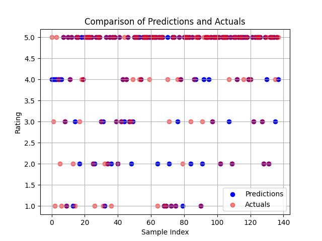

This is the line plot for prediction and actual ratings
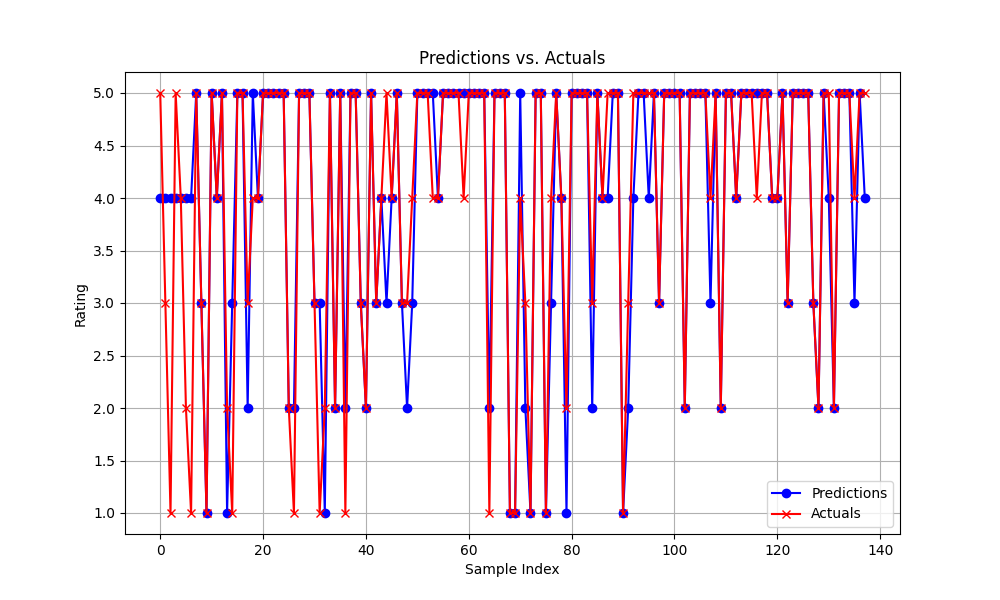

This is the error difference between prediction and actual ratings
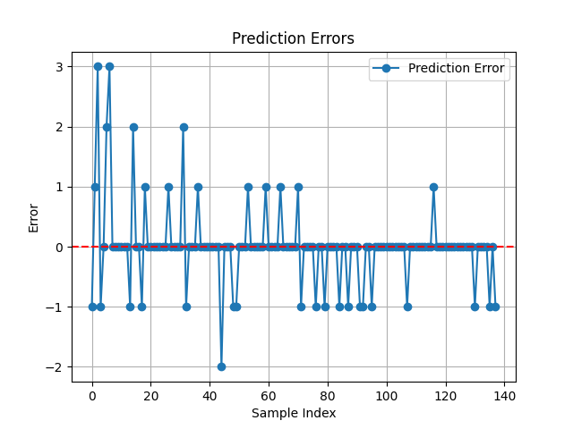

Fine tuning result:
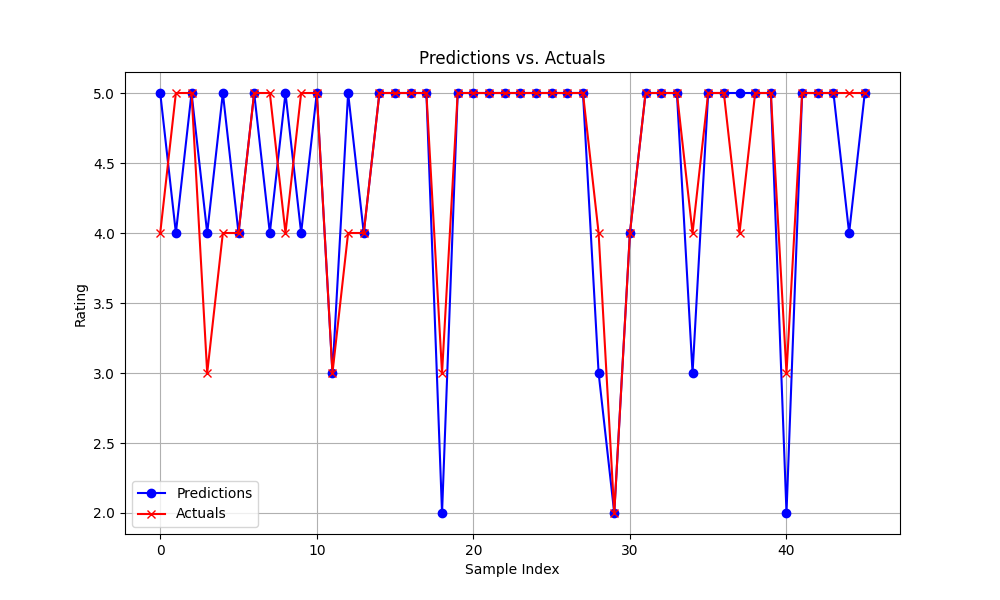
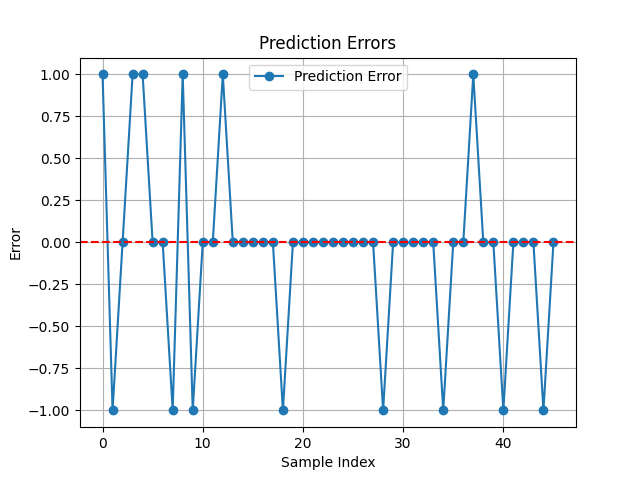

Fine tuning result for asian:
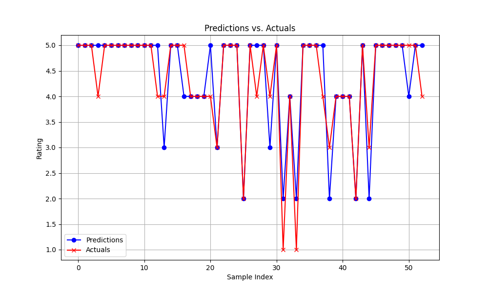
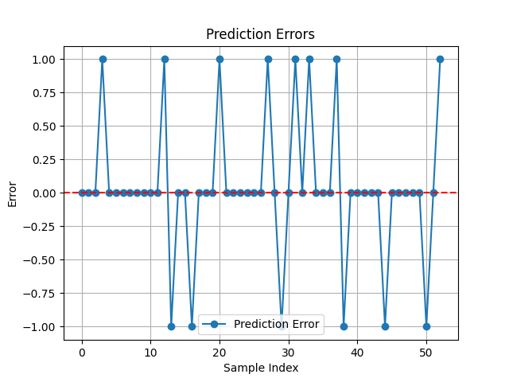

Fine tuning result for europe:
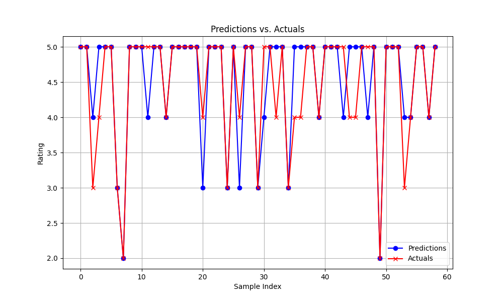
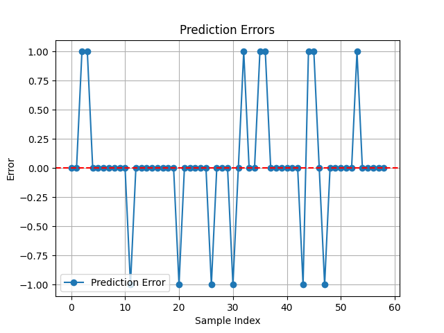

Fine tuning result for american:
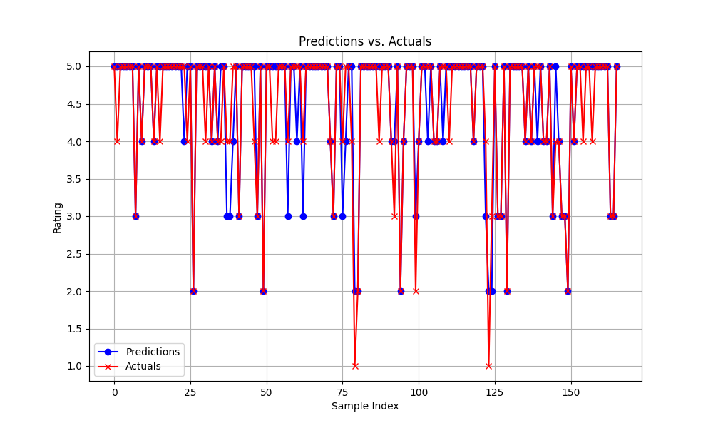
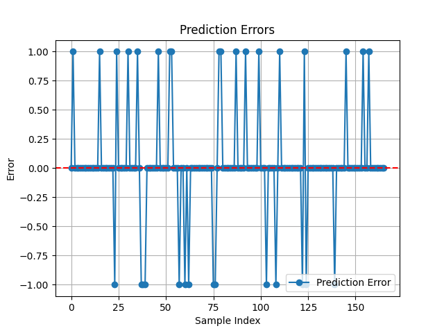
